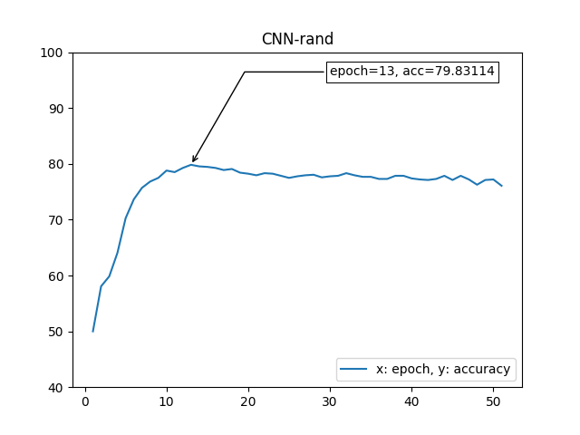
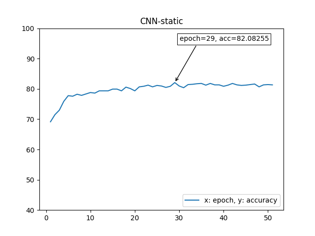
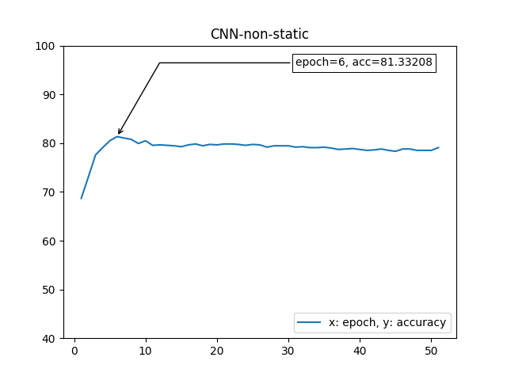
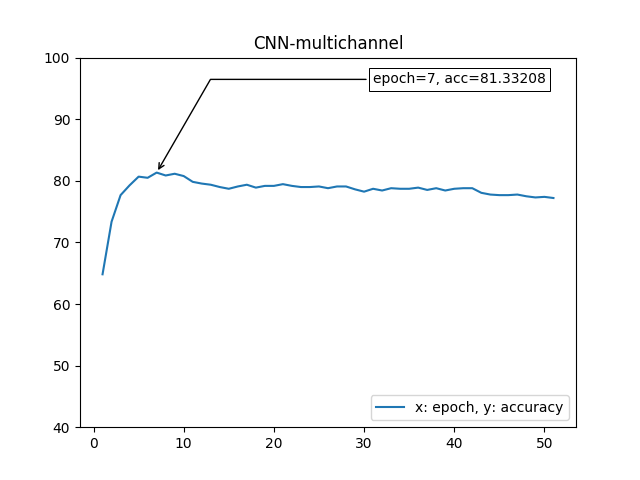

# Sentence_Classifier_CNN

Shindong Lee  

Korea University

## Performance

Accuracy on MR dataset (%)

|              | This Implementation |  Kim's Paper |
| :---         |     :---:           |     :---:    |
| CNN-rand     |   **79.8**   |   76.1   |
| CNN-static    |  **82.1**   |   81.0  |
| CNN-non-static  | 81.3    |  **81.5**   |
| CNN-multichannel | **81.3** | 81.1   |


 
 


This Implementation is compatible with both CPU and GPU  

Using RXT 2080ti,

Time for preprocessing < 1 minute  
Time for training 1 epoch < 1 second  
Time for validation < 1 second  

## Reference
"Convolutional Neural Networks for Sentence Classification" by Kim Yoon  
(paper: https://arxiv.org/pdf/1408.5882.pdf)  
(original implementation by Kim Yoon with Theano: https://github.com/yoonkim/CNN_sentence)  

Movie Reivew Dataset: (It's already inside the repo)  
(http://www.cs.cornell.edu/People/pabo/movie-review-data/rt-polaritydata.tar.gz)

## How to Run

1. download GoogleNews-vectors-negative300.bin from (https://github.com/mmihaltz/word2vec-GoogleNews-vectors)  
or from (https://drive.google.com/file/d/0B7XkCwpI5KDYNlNUTTlSS21pQmM/edit)    
2. unzip and save it into "pretrained" directory    

3. run following code    

```bash
$ python train.py --model [model] --num_epochs [num_epochs] --learning_rate [learning_rate] --mini_batch_size [mini_batch_size]
```

ex)  
```bash
$ python train.py --model CNN-rand --num_epochs 50 --learning_rate 0.0001 --mini_batch_size 50
```

<p align="center">
  or simply,
</p>
  

```bash
$ python train.py --model CNN-rand
```

model should be one of [CNN-rand, CNN-static, CNN-non-static, CNN-multichannel]  
